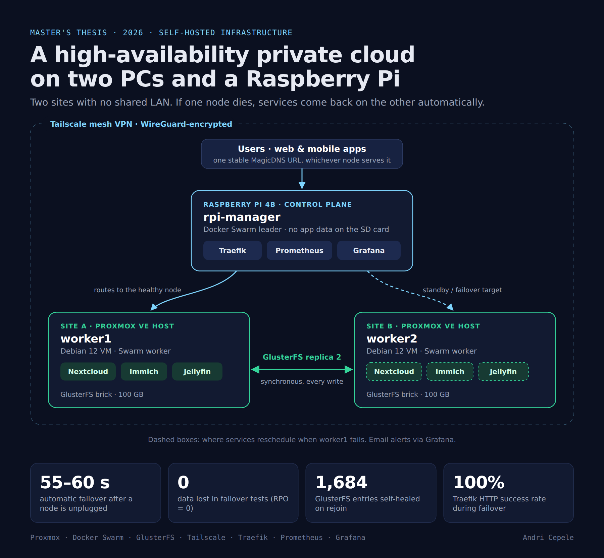
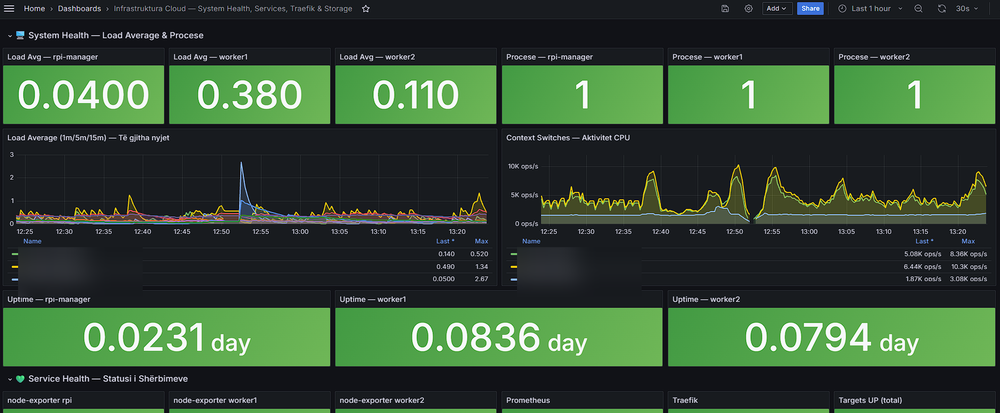

# Self-Hosted High-Availability Private Cloud

A distributed, self-healing private cloud built on commodity hardware (two repurposed PCs and a Raspberry Pi 4B) at **two physical sites with no shared LAN**. It runs Nextcloud, Immich and Jellyfin on Docker Swarm, replicates all data with GlusterFS and connects everything over a Tailscale (WireGuard) mesh. When a node is unplugged, the services come back on the surviving node automatically, with no data loss and no change to the URL users connect to.

This is the practical part of my Master's thesis in Computer Engineering (Polytechnic University of Tirana, 2026):
*"Design and Implementation of a Distributed Infrastructure for Hosting Personal Cloud Services with High Availability using Container Orchestration"*. The full thesis (Albanian, with an English abstract) and the defense slides are in [`docs/thesis/`](docs/thesis/).



## Results

Measured by physically cutting power to a worker node while clients were connected:

| Metric | Result |
|---|---|
| Failover time (RTO) | **55–60 s** from power loss until every service was running on the other node |
| Data loss (RPO) | **0**: Jellyfin library, Immich photos/albums and Nextcloud files all intact |
| Re-integration | Node rejoined on its own; GlusterFS self-heal synced **1,684** changed entries with no manual steps (3–5 min) |
| Routing during failover | Traefik reported a **100 %** HTTP success rate; clients reconnected without a manual refresh in most cases |
| User-facing URL | Unchanged throughout (one MagicDNS hostname, whichever node serves the request) |
| Reboot tests | Each worker and the manager rebooted on their own: all mounts and services came back with zero manual steps |

The 55–60 s is mostly Swarm's node-failure detection (3 missed heartbeats, 10 s apart) plus container cold start. I deliberately kept the defaults rather than tuning them down to about 20 s, because shorter timeouts risk rescheduling services during brief slowdowns that aren't real failures.

## Why this repo is worth reading

Most homelab write-ups show a system that "just works." This one also documents what happened when it didn't. Every incident is written up as a post-mortem with root cause, diagnosis and fix:

1. **[Swarm certificate expiry](docs/incident-reports/01-swarm-cert-expiry-and-recovery.md)**: the cluster was powered off for months and outlived Swarm's 90-day TLS certificate rotation. The whole control plane refused to start, and the post-mortem covers the full recovery.
2. **[Immich pgvecto.rs → VectorChord migration](docs/incident-reports/02-immich-pgvecto-migration.md)**: a floating `:release` tag jumped past a breaking database-extension change. I fixed it with a staged, version-by-version migration instead of a risky direct jump.
3. **[Failover testing and boot races](docs/incident-reports/03-failover-testing-and-boot-races.md)**: deliberately killing nodes uncovered a `/dev/sdX` disk-name swap, a Tailscale-before-mount race and a GlusterFS brick-before-mount race. All three are fixed permanently with UUIDs and custom systemd units.
4. **[Alerting audit](docs/incident-reports/04-alerting-audit.md)**: every alert showed "Normal", yet two RAM rules could never fire and the SMTP credential behind every notification had expired. The lesson: "configured" is not the same as "delivering".

## Architecture

| Node | Hardware / location | Role |
|---|---|---|
| `rpi-manager` | Raspberry Pi 4B (SD card) | Swarm manager (leader), Traefik ingress, Prometheus, Grafana. Stateless by design. |
| `worker1` | Debian 12 VM on Proxmox VE, **site A** | Swarm worker, GlusterFS brick, application services |
| `worker2` | Debian 12 VM on Proxmox VE, **site B** | Swarm worker, GlusterFS brick, application services |

Key design decisions (full rationale in [`docs/architecture.md`](docs/architecture.md)):

- **Tailscale instead of hand-rolled WireGuard + port forwarding.** The two sites have no shared LAN and may sit behind CG-NAT. Tailscale provides NAT traversal, key distribution and stable MagicDNS names, and exposes no open ports to the internet.
- **The manager stays outside GlusterFS.** An SD card's write endurance is a poor fit for brick or arbiter duty, so all stateful data lives only on the workers' replicated bricks.
- **Placement constraints (`node.labels.glusterfs == true`)** ensure databases can never be scheduled on a node without the replicated volume.
- **Pinned images (version tag or digest)** so every upgrade is a deliberate step, never a surprise.

## Stack

| Layer | Technology | Notes |
|---|---|---|
| Virtualization | Proxmox VE (×2 hosts) | One host per site |
| Orchestration | Docker Swarm | 1 manager, 2 workers |
| Networking | Tailscale (WireGuard mesh) | MagicDNS for stable hostnames across sites |
| Distributed storage | GlusterFS | Replica 2 on a 100 GB volume, no arbiter ([why](#known-limitations)) |
| Reverse proxy | Traefik v2.11 | Swarm provider, one entrypoint per service |
| Monitoring | Prometheus, Grafana, node_exporter | GlusterFS heal/split-brain metrics via textfile collector; email alerting |
| Applications | Nextcloud (MariaDB, Redis), Immich (Postgres + VectorChord, Redis), Jellyfin | |



## Lessons from the build (thesis chapter 12)

- **Newest is not always right.** Traefik v3.1's Swarm provider couldn't read cluster state on Docker Engine 29 (API-version mismatch), so I downgraded to v2.11 and verified it works. The lesson is to check compatibility across the stack, not just pick the newest version number.
- **GlusterFS has a real small-file tax.** Nextcloud's first install (~700 MB of small PHP files) took 8–12 minutes on the replicated volume versus about 30 s on local disk. A better split would replicate only user data (`/data`), not the application code.
- **cAdvisor vs. cgroup v2.** Per-container metrics didn't work inside Swarm on kernel 6.x with the systemd cgroup driver. I left this out of scope and documented it as future work (it would need cAdvisor on the host, privileged).

## Repository structure

```
├── stacks/                  Swarm stack files for every service
│   ├── traefik/
│   ├── monitoring/          + Prometheus config and sanitized Grafana alert rules
│   ├── jellyfin/
│   ├── immich/
│   └── nextcloud/
├── systemd/                 Units that fix real boot-order races (Tailscale, GlusterFS brick)
├── scripts/                 DB backups, GlusterFS heal/split-brain metrics
└── docs/
    ├── architecture.md      Design rationale and trade-offs
    ├── deployment.md        How to deploy from this repo
    ├── incident-reports/    Real incidents, root-caused and fixed
    ├── runbooks/            Safe shutdown/startup, tested disaster-recovery restore
    ├── images/              Diagram and (sanitized) dashboard screenshots
    └── thesis/              Full thesis and defense presentation (PDF)
```

## Known limitations

Documented honestly, not hidden:

- **Single Swarm manager.** If the Pi goes down, the containers already running on the workers keep running, but nothing can be rescheduled and external access through Traefik stops until it returns. Real control-plane HA needs 3 managers for Raft quorum. This was tested: the manager recovers cleanly on its own reboot.
- **No GlusterFS arbiter.** An arbiter brick would close the theoretical split-brain window during a partition between the two workers. It was deliberately not placed on the Pi's SD card; this is a documented trade-off, not an oversight.
- **No per-service (replica 0/1) alerting yet.** Node-level and GlusterFS alerts exist, but a container crashing without taking its node down has no dedicated alert.
- **No per-container metrics** (see cAdvisor above).

## Future work

A second (and third) manager for Raft quorum, a lightweight arbiter node on SSD-backed storage, per-service alerting, host-level cAdvisor, and separating Nextcloud app code from user data on GlusterFS.

## Author

**Andri Cepele**

## License

MIT, see [LICENSE](LICENSE).
